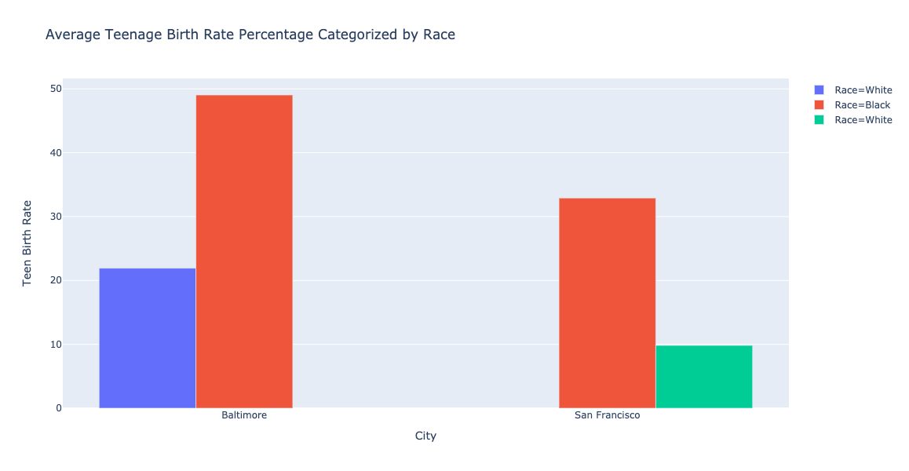

# Revisiting Teen Birth Rate Comparison in Baltimore, MD and San Francisco, CA. 
## Background Information 
A lack of sexual health services and education have perpetuated the increase in teenage pregnancy rates in Baltimore, MD, [especially in the city's BIPOC populations](https://health.baltimorecity.gov/node/170). One way to understand the prevalence of this public health crisis in minority groups is to observe data trends categorized by race within the city's neighborhoods. Using Opportunity Atlas data on teenage birth rates of low-income populations in Baltimore, MD and my hometown, San Francisco, CA, we can identify whether differences exist in teenage birth rates in certain populations of Baltimore and how these differences compare to those of another U.S. metropolitan area. Ultimately, we can use such data trends to design effective policy to mitigate the rise in teenage pregnancy. 
## Business Question 
_How do health-related racial disparities contribute to teen birth rates of populations with low parent income in Baltimore, MD and San Francisco, CA?_
## Data Sources
Open data sourced from Opportunity Insights' [Opportunity Atlas](https://opportunityinsights.org/data/?geographic_level=0&topic=0&paper_id=1652#resource-listing), an online database of anonymous data following 20 million Americans from childhood to mid-30s with the goal of identifying areas of the United States with best and worst social mobility. We will compare Baltimore, MD and San Francisco, CA, using two datasets.
1. Baltimore, MD: raw dataset containing teenage birth rates for [White](sf-teenbirth-w.csv) and [Black](sf-teenbirth-b.csv) populations with low-income parents, categorized by neighborhood in Baltimore City.
1. San Francisco, CA: raw dataset containing teenage birth rates for [White](balt-teenbirth-w1.csv) and [Black](balt-teenbirth-b.csv) populations with low-income parents, categorized by neighborhood in San Francisco. 
1. **baltimore_sf_teenbirth_kathytien.ipynb**: a Google Colaboratory notebook with analysis of Baltimore and San Francisco data. 
## Data Answer 
To isolate health disparities due to race, we eliminated differences due to geographic location and socioeconomic status by comparing teenage birth rates of low-income populations residing in the same neighborhoods for both cities. We merged datasets within Google Colaboratory, and teenage birth rates of White and Black populations in Baltimore and San Francisco were averaged and compared in the following Plotly Express visualization. 
 
Mirorring the results produced by Excel, both average White and Black teen birth rates are higher for Baltimore than that of San Francisco. This difference may be attributed to Baltimore's lower government funding of health services, a higher poverty rate, and an overall lower percentage of the population insured. In both cities, the average White birth rate is more than twice the average Black birth rate. These results show that even when we compare within the same income level, racial and socio-ecological disparities contribute to the substantially higher teen birth rates in Black populations. Therefore, effective policy should cater to specifically to the healthcare needs of the disadvantaged minority populations. To expand into other socio-ecological factors that contribute to access to sexual health resources, we can look into contraceptive use among teens, drug and alcohol use, efficacy of existing sexual health education, etc.
## Comparing Python and Excel 
Though there were clear differences in the process of data organization for Python and Excel, the final visualization produced very similar results. I prefer working in Python than in Excel, especially for data analysis. Repeated functions and formulas were much easier and faster to perform in Python than in Excel; there were fewer parameters to work with in Python, and all tasks can be carried out with one continuous line of code. If I made an error in Python, the error code would locate the line of code in which the error occurred. In Excel, I would have needed to troubleshoot and run the functions multiple times to find the error. 

In my Colaboratory Notebook, I struggled most with producing a grouped bar chart with teen birth rates of both White and Black populations. The mistake was on my end - the x and y variables within my dataset were not organized to produce an accurate bar chart. Overall, data was much easier to organize and customize in Python than in Excel. With that said, there was definitely a learning curve with manipulating data in Python.
